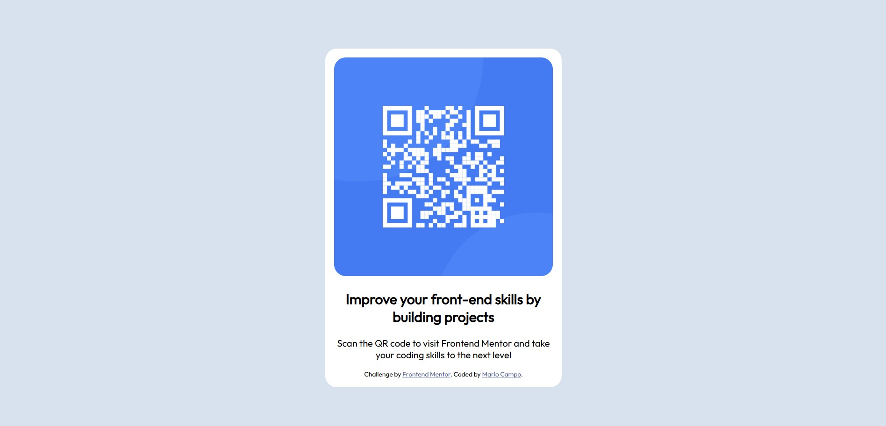

# Frontend Mentor - QR code component solution

This is a solution to the [QR code component challenge on Frontend Mentor](https://www.frontendmentor.io/challenges/qr-code-component-iux_sIO_H). Frontend Mentor challenges help you improve your coding skills by building realistic projects. 

## Table of contents

- [Overview](#overview)
  - [Screenshot](#screenshot)
  - [Links](#links)
- [My process](#my-process)
  - [Built with](#built-with)
  - [What I learned](#what-i-learned)
  - [Continued development](#continued-development)
  - [Useful resources](#useful-resources)
- [Author](#author)

## Overview

### Screenshot



### Links

- Solution URL: (https://github.com/MarioCampoDev/qrcodeinfo)
- Live Site URL: (https://mariocampodev.github.io/qrcodeinfo/)

## My process

### Built with

- Semantic HTML5 markup
- CSS custom properties
- Flexbox

### What I learned

I am a programmer focused on back end, I am entering the world of front end to not be so basic in terms of styles.

For me it was quite a challenge (and very difficult) to get closer to the final result.

Since it is the first time that I enter the front end and it is difficult for me to even do the most basic thing (center an element)

I'm open to any comments, since for such a newbie, I feel like I did well.

Although in many examples work with the body directly. I preferred to work with the section that was going to contain my elements for the challenge.

```css
.qrCard {
    display: flex;
    justify-content: center;
    align-items: center;
    text-align: center;
    min-height: 100vh;
    border-radius: 20px;
}

.backCard {
    background-color: white;
    width: 375px;
    padding: 15px;
    border-radius: 20px;
    overflow: hidden;
}
```

### Continued development

I would like to continue learning to be competent regarding the front end.

### Useful resources

- [Example resource 1](https://flexboxfroggy.com/#es) - This helped me to understand better how to use flexbox.

## Author

- GitHub - [MarioCampoDev](https://github.com/MarioCampoDev)
- Frontend Mentor - [@MarioCampoDev](https://www.frontendmentor.io/profile/MarioCampoDev)
